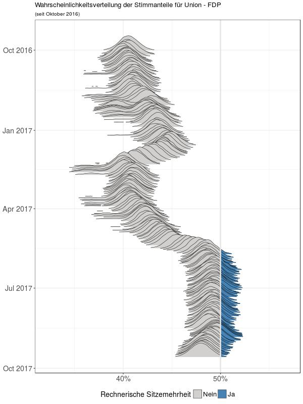

```{r setup, include=FALSE}
library(knitr)
library(kableExtra)
opts_knit$set(
	message = FALSE,
	warning = FALSE,
	echo    = FALSE,
	cache   = TRUE,
	fig.align="center")
options(htmltools.dir.version = FALSE)
library(dplyr)
library(tidyr)
library(purrr)
library(coalitions)
library(stringr)
library(ggplot2)
theme_set(theme_bw())
library(ggridges)
surveys <- get_surveys()

# paty colors
.party_cols_de <- c(
	"cdu"     = "black",
	"spd"     = "#E3000F",
	"greens"  = "#46962b",
	"fdp"     = "#eec900",
	"left"    = "#cd1076",
	"pirates" = "brown",
	"afd"     = "skyblue",
	"others"  = "grey")
```
class: inverse
# Outline

- Why probabilities?

--

- Implementation (Backend)

--

- Implementation (Frontend)

--

- What to look for on election night?


---
# Why probabilities
When covering the election, media outlets (TV and print) mostly focus on
questions like

> Which parties will pass the 5% threshold and enter the "Bundestag" (German parliament)?

and

> Which parties will form the governing coalition
(currently Union - SPD, so called *grand coalition*)?

For the 2017 election also of special interest

> Which party will have the 3rd largest share of votes?


---
# Why probabilities?
To answer these questions, pundits and writers usually focus on raw voting intention polls:
&nbsp;
&nbsp;
&nbsp;

> "Which party would you vote for if election was today?"

&nbsp;
&nbsp;

```{r, warning=FALSE, echo=FALSE}
latest <- get_latest() %>%
	select(-start, -end) %>%
	unnest() %>%
	select(-votes) %>%
	mutate(
		party   = prettify_en(party),
		percent = paste0(percent, "%"))
# kable(latest, format="html", align=c("lrrlr"))
forsa_tab1 <- readRDS("forsa_tab_1.Rds")
kable(forsa_tab1, format="html", caption="Last FORSA poll before the 2013 election (September, 20th); n = 1995", align="rrrrrrr")
```

---
# Why probabilities
Interpretation of raw polls is problematic for several reasons

1. Sample uncertainty is ignored (even if the sample is representative, we would
expect individual polls to deviate from the true shares).
  - Exhibit 1.a: <a href="https://twitter.com/btwahltrend/status/905031505671585793"> pollytix - Koalitionsrechner</a>
  - Exhibit 1.b: <a href="https://twitter.com/tagesschau/status/910485863649472512">
	Tagesschau </a>

2. Redistribution of votes is ignored (all votes for parties that do not
pass the 5% threshold are redistributed proportionally to parties that pass
the threshold).
  - Exhibit 2: <a href="http://www.faz.net/aktuell/politik/bundestagswahl/bundestagswahl-schwarz-gelb-verliert-die-mehrheit-15143172.html">FAZ</a>

3. Overreaction to individual polls (Some polls can be "off" or only depict
the voting intention in a very short time-period; different weighting methods
used by different pollsters)
  - see Exhibits 1.b and 2

---
# Example: BTW13
```{r echo=FALSE, results="asis", fig.width=8, fig.height=5, fig.align = "center", message=FALSE}
forsa_13 <- readRDS("forsa_13.Rds") %>%
	mutate(
		party = factor(party, levels=party, labels=prettify_en(party)) ,
		percent = round(percent * 100, 1))
forsa_tab1 <- readRDS("forsa_tab_1.Rds")
kable(forsa_tab1, format="html", caption="Last FORSA poll before the 2013 election (September, 20th); n = 1995", align="rrrrrrr")

names(.party_cols_de) <- prettify_en(names(.party_cols_de))
ggplot(forsa_13,
	aes(x=party, y=percent, fill=party)) +
	geom_bar(stat="identity") +
	scale_fill_manual(values=.party_cols_de) +
	geom_hline(yintercept = 5, lwd=1.2, col="grey80") +
	theme(
		legend.position = "none",
		axis.text=element_text(size=rel(1.5))) +
	xlab("") + ylab("") +
	scale_y_continuous(labels= function(x) paste0(x, "%")) +
	ylim(c(0, 50))
```


---
# Example: BTW13
Taking this poll at face value, 10% of votes would be redistributed:

```{r echo=FALSE, message=FALSE, results="asis", fig.align="center", fig.height=5, fig.width=7}
frd_13 <- readRDS("forsa_redist_13.Rds")
tab <- frd_13 %>%
	select(-seats) %>%
  mutate(
    share = str_pad(paste0(share, "%"), 3)) %>%
  spread(party, share)
kable(tab, format="html", caption = "FORSA poll after redistribution.",
	align="rrrrrrr")
ggplot(frd_13,
	aes(x=party, y=share, fill=party)) +
	geom_bar(stat="identity") +
	scale_fill_manual(values=.party_cols_de) +
	theme(
		legend.position = "none",
		axis.text=element_text(size=rel(1.5))) +
	xlab("") + ylab("") +
	scale_y_continuous(labels= function(x) paste0(x, "%"), limits = c(0, 50))
```


---
# Example: BTW13

- This still ignores the sample uncertainty
- Therefore, we sample election outcomes from the Dirichlet distribution

```{r, eval=FALSE}
forsa_13$percent
round(gtools::rdirichlet(3, 1995*forsa_13$percent+0.5), 4)
```
```
##        [,1]   [,2]   [,3]   [,4]   [,5]   [,6]   [,7]   [,8]
## [1,] 0.4022 0.2634 0.1014 0.0439 0.0894 0.0157 0.0425 0.0414
## [2,] 0.4206 0.2526 0.0915 0.0446 0.0949 0.0210 0.0336 0.0413
## [3,] 0.4152 0.2629 0.0965 0.0518 0.0872 0.0154 0.0356 0.0353
```
```{r, eval=FALSE}
round(gtools::rdirichlet(3, 20*forsa_13$percent+0.5), 4)
```
```
##        [,1]   [,2]   [,3]   [,4]   [,5]   [,6]   [,7]   [,8]
## [1,] 0.4861 0.2415 0.0551 0.0123 0.0663 0.0148 0.0969 0.0270
## [2,] 0.2443 0.1557 0.2510 0.1100 0.0548 0.0205 0.0898 0.0738
## [3,] 0.4347 0.2295 0.0750 0.1335 0.0505 0.0016 0.0732 0.0021
```

---
# Example: BTW13
- Based on a simulation with $n=10000$, FDP would not pass the 5% threshold in 50% of the cases
- This leads to a bimodal distribution (after redistribution)

```{r echo=FALSE, message=FALSE, fig.align="center", fig.width=7.8, fig.height=6}
seats <- readRDS("forsa_seats_13.Rds")
seats_coalition <- seats %>%
	filter(party %in% c("cdu", "fdp")) %>%
	spread(party, seats, fill=0) %>%
	group_by(sim) %>%
	mutate(
		"Union|FDP" = sum(cdu, fdp),
		FDPout = fdp == 0) %>%
	rename(Union = cdu, FDP = fdp) %>%
	gather(party, percent, -sim, -FDPout) %>%
	mutate(percent = percent/598 * 100)
ggplot(seats_coalition, aes(x=percent, group=FDPout, fill=FDPout)) +
	geom_density(bw=0.2, alpha=0.5) +
	# geom_vline(xintercept = 50, lwd=1.1, col="grey80") +
	facet_wrap(~party, scales="free_x")  +
	scale_fill_manual(
		breaks = c(TRUE, FALSE),
		labels = c("No", "Yes"),
		values = rev(c("darkred", "deepskyblue2")),
		name   = "FDP above 5% threshold") +
	xlab("") + ylab("") +
	scale_x_continuous(labels=function(x) paste0(x, "%")) +
	theme(
		legend.position = "bottom",
		legend.text     = element_text(size = rel(1.2)),
		legend.title    = element_text(size = rel(1.3)),
		axis.text       = element_text(size = rel(1.3)),
		strip.text      = element_text(size = rel(1.3)))
```

???
- In summary:
	- When FDP is below 5% (about 50% of the cases), the Union gets a larger share
	of votes (due to redistribution), but less than 5%
	- When FDP is above 5%, Union is weaker (no redistribution), but Union|FDP
		stronger (in ca. 50% of these cases Union|FDP would gain simple majority)
	- Probability of majority for Union|FDP $\sim$ 25%
	- Using our method we calculate a probability that Union|FDP get a simple majority
	as 27% (FiveThirthyEight US-Election forecast for Trump: $\sim 28\%$)


---
# Example: BTW13

- Coalition probabilities can be obtained by calculating the area underneath
the probability distribution for $x> 50%$
- Or simpler: $P(\text{event}|\text{sample})=\frac{\# \text{simulations with event}}{\# \text{simulations}}$

```{r echo=FALSE, fig.align="center", fig.width=5, fig.height=5, message=FALSE}
ggplot(filter(seats_coalition, party=="Union|FDP"), aes(x=percent, y=0)) +
	geom_density_ridges_gradient(aes(fill=..x..>50)) +
	geom_vline(xintercept = 50, lwd=1.1, col="grey80") +
	scale_fill_manual(
		breaks = c(FALSE,TRUE),
		labels = c("No", "Yes"),
		values = c("grey70", "steelblue"),
		name   = "Votes share Union|FDP > 50%") +
	xlab("") + ylab("") +
	scale_x_continuous(labels=function(x) paste0(x, "%")) +
	theme(
		legend.position = "bottom",
		legend.text     = element_text(size = rel(1.2)),
		legend.title    = element_text(size = rel(1.3)),
		axis.text       = element_text(size = rel(1.3)),
		strip.text      = element_text(size = rel(1.3)))
```


---
# KOALA: Coalitions Analysis

In [our approach](http://www.stablab.stat.uni-muenchen.de/forschung/koala/methodik.pdf) we
- aggregate polls from different pollsters within a 14-day time-window
(pooled survey)

- Calculate the Posterior Dirichlet distribution (based on Multinomial Likelihood
and flat/uninformative Dirichlet Prior)

- Calculate "secondary" properties (e.g. probability that Union-FDP would have simple majority) via Monte-Carlo sampling

	- Simulate election outcomes from known Posterior (based on current pooled survey)

	- $P(\text{event}|sample) = \frac{\# \text{event}}{\text{number of simulations}}$


---
# Implementation (Backend)

- Backend implemented in the R-package `coalitions`
	(see [Workflow vignette](https://adibender.github.io/coalitions/articles/workflow.html))

	- scrapes wahlrecht.de for (new) polls

	- (calculates *pooled* sample)

	- calculate and sample from Posteriori

	- Redistribute votes below 5% threshold and calculate Seats based on
	method by [Sainte-Lague-Scheppers](http://www.wahlrecht.de/verfahren/rangmasszahlen.html) (German Law)

	- Calculate coalition probabilities

---
# Implementation (Backend)
- Install via
```{r, eval=FALSE}
devtools::install_github("adibender/coalitions")
```

- Surveys returned as *nested* tidy data set (`tibble`)
```{r getSurveys, cache=TRUE, warning=FALSE}
surveys <- get_surveys()
surveys
```

---
# Implementation (Backend)

```{r, dependson="getSurveys"}
surveys %>%
	unnest() %>%
	select(-start, -end)
```

---
# Implementation (Backend)
```{r dependson="getSurveys"}
surveys %>%
	unnest() %>%
	slice(1) %>%
	unnest() %>%
	select(-start, -end)
```

---
<!-- # Implementation (Backend) -->
### pooled survey
```{r, dependson="getSurveys"}
pooled_survey <- surveys %>% pool_surveys()
pooled_survey %>% select(-start, -end)
```

---
### Draw from Posterior
```{r dependson="getSurveys"}
draws <- pooled_survey  %>%
	draw_from_posterior(seed=123)
draws[1:6, ]
## calculate probabilities to pass 5% threshold
draws %>% summarize_all(funs(mean(.>0.05)))
```

---
### Redistribution and seats calculation
```{r seats, dependson="getSurveys", cache=TRUE}
seats <- get_seats(draws, pooled_survey, distrib.fun=sls, hurdle=0.05)
seats
```

---
### Calculate coalition probabilities
```{r probs, dependson="getSurveys"}
probs <- seats %>% have_majority() %>%
	calculate_probs(coalitions=list(c("cdu", "fdp"), c("cdu", "fdp", "greens")))
probs
```

---
### Wrapper
```{r dependson="getSurveys", cache=TRUE}
set.seed(123)
pooled_survey %>%
	nest(party:votes, .key="survey") %>%
	get_probabilities(seed=123) %>%
	unnest()
```

---
# Visualization
- We visualize the posterior via "ridgeline plots" ([formerly Joy plots](http://serialmentor.com/blog/2017/9/15/goodbye-joyplots))

- Uses `ggplot`, `ggridges`, `gganimate`
- (click <a href="test-joy.gif">here</a> for animated version)

<a href="test-joy-static.jpeg" align="middle">
	
</a>


---
# Joy/Ridges-Plot (Implementation)
```{r, eval=FALSE}
gg_distrb <- ggplot(schw_gelb, aes(x = percent, y = date2,
	group=date2, frame=date, cumulative=TRUE, fill=..x..>50)) +
	geom_density_ridges_gradient(scale = 10, size = 0.25) +
	geom_vline(xintercept = 50, lty=1, lwd=1.2, col="grey90") +
	scale_fill_manual(
		name   = "Rechnerische Sitzemehrheit",
		breaks = c("FALSE", "TRUE"),
		labels = c("Nein", "Ja"),
		values = c("#d1d0ce", "steelblue") ) +
	theme(legend.position = "bottom")  +
	scale_x_continuous(labels = function(x) paste0(x, "%")) +
	scale_y_continuous(trans = rev_date) +
	guides(fill=guide_legend(override.aes=list(alpha=1))) +
	theme(
		axis.text    = element_text(size = rel(1.3)),
		axis.title.y = element_blank(),
		axis.title.x = element_blank(),
		legend.text  = element_text(size = rel(1.2)),
		legend.title = element_text(size = rel(1.3))) +
	labs(
		title = "Wahrscheinlichkeitsverteilung der Stimmanteile für Union - FDP",
		subtitle = "(seit Oktober 2016)")
```

---
# Joy/Ridges-Plot (Implementation)
```{r, eval=FALSE}
gg_distrb <- ggplot(schw_gelb, aes(x = percent, y = date,
	group=date, frame=date, cumulative=TRUE, fill=..x..>50)) +
   geom_density_ridges_gradient(scale = 10, size = 0.25) +
	# geom_vline(xintercept = 50, lty=1, lwd=1.2, col="grey90") +
	# scale_fill_manual(
	# 	name   = "Rechnerische Sitzemehrheit",
	# 	breaks = c("FALSE", "TRUE"),
	# 	labels = c("Nein", "Ja"),
	# 	values = c("#d1d0ce", "steelblue") ) +
	# theme(legend.position = "bottom")  +
	# scale_x_continuous(labels = function(x) paste0(x, "%")) +
	# scale_y_continuous(trans = rev_date) +
	# guides(fill=guide_legend(override.aes=list(alpha=1))) +
	# theme(
	# 	axis.text    = element_text(size = rel(1.3)),
	# 	axis.title.y = element_blank(),
	# 	axis.title.x = element_blank(),
	# 	legend.text  = element_text(size = rel(1.2)),
	# 	legend.title = element_text(size = rel(1.3))) +
	# labs(
	# 	title = "Wahrscheinlichkeitsverteilung der Stimmanteile für Union - FDP",
	# 	subtitle = "(seit Oktober 2016)")
```

---
# Animation
- **If you're able to `ggplot`, you are able to `gganimate`!**
- The **`gganimate`** package currently not on CRAN, install via:
```{r, eval=FALSE}
devtools::install_github("drgtwo/gganimate")
```

```{r, eval=FALSE}
library(ggplot2)
library(ggridges)
library(gganimate)
gg_distrb <- ggplot(schw_gelb, aes(x = percent, y = date,
 		group=date, frame=date, cumulative=TRUE, fill=..x..>50)) +
	geom_density_ridges_gradient(scale = 10, size = 0.25)
gganimate(gg_distrb, "output.gif", interval=.2, ani.width=600)
```

- Set GIF parameters (width, height, etc. via `ani.options`)
- Control speed of the animation via `interval` argument </br>
(lower values $\rightarrow$ higher speed)
- Don't forget to set the `frame` argument in the call to `ggplot` (this is
the variable over which the animation will iterate)
- By setting `cumulative=TRUE` current frame also contains previous frames
- Note: `alpha` argument does not work with `*_gradient` geoms


---
# Sources

- Raw voting intention polls: [wahlrecht.de](http://www.wahlrecht.de/)

- KOALA homepage (shiny app): [koala.stat.uni-muenchen.de](http://koala.stat.uni-muenchen.de/)

- Twitter: [@KOALA_LMU](https://twitter.com/KOALA_LMU)

- [Statistical Consulting Unit](http://www.stablab.stat.uni-muenchen.de/index.html)

- [Xaringan slides](https://slides.yihui.name/xaringan/#1)


