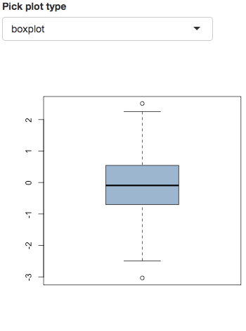
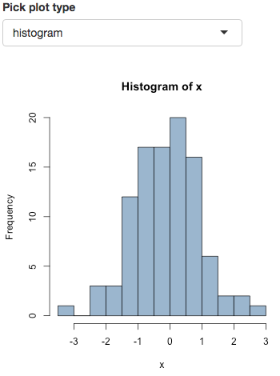

```{r setup, include=FALSE}
options(htmltools.dir.version = FALSE)
```

background-image: url("image/Koala_Logo_Schrift_hell.png")
background-position: 97% 2%
background-size: 150px
class: inverse
# Outline
<hr style='border:solid darkgray 1px; height:0px; margin-top:-20px; margin-bottom:50px'/>

- Why probabilities?

--

- Implementation (Backend)

--

- Implementation (Frontend)

--

- Outlook & sources


---
background-image: url("image/Koala_Logo_Schrift.png")
background-position: 97% 2%
background-size: 150px
background-color: whitesmoke
# Motivation
<hr style='border:solid gray 1px; height:0px; margin-top:-20px; margin-bottom:50px'/>

For the German Bundestag election, the most important questions are

> Which parties will form the governing coaliton?

and

> Which parties will enter the Bundestag (pass the 5% threshold)?


---
background-image: url("image/Koala_Logo_Schrift_hell.png")
background-position: 97% 2%
background-size: 150px
class: inverse
# Frontend implementation
<hr style='border:solid darkgray 1px; height:0px; margin-top:-20px; margin-bottom:50px'/>

1) Creating a homepage with shiny

2) Setting up the server with shiny server

3) APIs and stuff: tweetR and googlesheets

4) Keep the website running

---
class: inverse
<iframe src='http://koala.stat.uni-muenchen.de' style='width:100%; height:96%'/>


---
background-image: url("image/Koala_Logo_Schrift.png")
background-position: 97% 2%
background-size: 150px
background-color: whitesmoke
# Frontend - shiny
<hr style='border:solid gray 1px; height:0px; margin-top:-20px; margin-bottom:50px'/>

shiny in a nutshell:
- R package by RStudio

- Web application framework

- Creation of interactive dashboards, running R in the background

- Resources: <a href='https://www.meetup.com/de-DE/Applied-R-Munich/events/226912554/' target='_blank'>Applied R shiny meetup</a>,  <a href='http://shiny.rstudio.com/' target='_blank'>shiny.rstudio.com</a>

- Tip: Use <a href='https://rstudio.github.io/shinydashboard/' target='_blank'>shinydashboard</a> for a more appealing dashboard UI

--

<br/>
Why shiny?

- Easy integration of interactive R output and calculations

- No need for learning another language, shiny creates the HTML, CSS and JavaScript for you!


---
background-image: url("image/Koala_Logo_Schrift.png")
background-position: 97% 2%
background-size: 150px
background-color: whitesmoke
# Frontend - shiny
<hr style='border:solid gray 1px; height:0px; margin-top:-20px; margin-bottom:50px'/>




---
background-image: url("image/Koala_Logo_Schrift.png")
background-position: 97% 2%
background-size: 150px
background-color: whitesmoke
# Frontend - shiny
<hr style='border:solid gray 1px; height:0px; margin-top:-20px; margin-bottom:50px'/>

```R
library(shiny)


ui <- fluidPage(
  selectInput("plotType_picker", "Pick plot type",
              choices = c("boxplot","histogram")),
  plotOutput("my_plot")
)
server <- function(input, output) {
  x <- rnorm(100)
  output$my_plot <- renderPlot({
    if (input$plotType_picker == "boxplot") {
      boxplot(x)
    } else
      hist(x)
  })
}


shinyApp(ui = ui, server = server)
```


---
background-image: url("image/Koala_Logo_Schrift.png")
background-position: 97% 2%
background-size: 150px
background-color: whitesmoke
# Frontend - shiny server
<hr style='border:solid gray 1px; height:0px; margin-top:-20px; margin-bottom:50px'/>

shiny server in a nutshell:

- Linux-based open source web server by RStudio

- ...

--

<br/><br/>
Resources:

- test

- ...


---
background-image: url("image/Koala_Logo_Schrift.png")
background-position: 97% 2%
background-size: 150px
background-color: whitesmoke
# Frontend - shiny server
<hr style='border:solid gray 1px; height:0px; margin-top:-20px; margin-bottom:50px'/>

Setting up shiny server (on Ubuntu 12.04+): (<a href='http://docs.rstudio.com/shiny-server/' target='_blank'>administrator's guide</a>)

1) Install R on the server and install all needed R packages

2) Install shiny server (<a href='https://www.rstudio.com/products/shiny/download-server/' target='_blank'>install guide</a>)
```bash
$ sudo apt-get install gdebi-core
$ sudo wget https://download3.rstudio.org/ubuntu-12.04/x86_64/shiny-server-1.5.3.838-amd64.deb
$ sudo gdebi shiny-server-1.5.3.838-amd64.deb
```

3) Customize the shiny-server.conf file

4) ...


---
background-image: url("image/Koala_Logo_Schrift.png")
background-position: 97% 2%
background-size: 150px
background-color: whitesmoke
# Frontend - shiny server
<hr style='border:solid gray 1px; height:0px; margin-top:-20px; margin-bottom:50px'/>

Capabilities of the free version:

- only up to 20 users simultaneously

- running on 1 core
-> code efficiently (e.g. pregenerate all plot objects)

--

<a href='https://www.rstudio.com/products/shiny/shiny-server/' target='_blank'>Alternatives</a>:

- RStudio Connect? Geht des a ois Webserver?

- https://www.shinyapps.io: ...

- shiny server Pro: ...

... or host the website yourself


---
background-image: url("image/Koala_Logo_Schrift.png")
background-position: 97% 2%
background-size: 150px
background-color: whitesmoke
# Frontend - tweetR 
<hr style='border:solid gray 1px; height:0px; margin-top:-20px; margin-bottom:50px'/>

The tweetR package in a nutshell:

- Our use case: Send tweets with new results

- Resources: <a href='http://geoffjentry.hexdump.org/twitteR.pdf' target='_blank'>user vignette</a>, <a href='https://github.com/geoffjentry/twitteR' target='_blank'>tweetR on GitHub</a>

- Alternative (more modern) package: <a href='http://rtweet.info/' target='_blank'>rtweet</a>


---
background-image: url("image/Koala_Logo_Schrift.png")
background-position: 97% 2%
background-size: 150px
background-color: whitesmoke
# Frontend - tweetR 
<hr style='border:solid gray 1px; height:0px; margin-top:-20px; margin-bottom:50px'/>

Sending a Tweet with tweetR:

1) Register a new Twitter app on <a href='https://apps.twitter.com/' target='_blank'>apps.twitter.com</a>

2) Use the credentials to do the authorization with R
```R
setup_twitter_oauth(consumer_key = "your_consumer_key",
                    consumer_secret = "your_consumer_secret",
                    access_token = "your_access_token",
                    access_secret = "your_access_secret")
```

3) Start tweeting!
```R
tweet(message = "Tweet tweet", mediaPath = "my_picture.png")
```

---
background-image: url("image/Koala_Logo_Schrift.png")
background-position: 97% 2%
background-size: 150px
background-color: whitesmoke
# Frontend - googlesheets 
<hr style='border:solid gray 1px; height:0px; margin-top:-20px; margin-bottom:50px'/>

The googlesheets package in a nutshell:

- Our use case: Offering an API for our results

- Resources: <a href='https://github.com/jennybc/googlesheets' target='_blank'>googlesheets on GitHub</a>


---
background-image: url("image/Koala_Logo_Schrift.png")
background-position: 97% 2%
background-size: 150px
background-color: whitesmoke
# Frontend - googlesheets 
<hr style='border:solid gray 1px; height:0px; margin-top:-20px; margin-bottom:50px'/>

Exporting a table to Google Sheets with googlesheets:

1) Extract your credentials:
```R
auth_info <- gs_auth()
saveRDS(auth_info, file = "auth_info.rds")
```

2) Use the credentials to do the authorization with R
```R
gs_auth(token = "auth_info.rds")
```

3) Start uploading!
```R
my_table <- data.frame("person"      = c("Sepp","Uli","Franz"),
                       "likes_koala" = c("yes", "yes", "yes"))
write.csv(my_table, file = "my_table.csv")
gs_upload("my_table.csv", sheet_title = "my_googleSheet",
          overwrite = TRUE)
```


---
background-image: url("image/Koala_Logo_Schrift.png")
background-position: 97% 2%
background-size: 150px
background-color: whitesmoke
# Frontend - Keep the website running
<hr style='border:solid gray 1px; height:0px; margin-top:-20px; margin-bottom:50px'/>

Automation of the server:

- We check hourly if new surveys are available and update the results

- Implementation: see next slide

- Tip: Automatic error notification using <a href='https://www.pushbullet.com/' target='_blank'>Pushbullet</a> 

  - Supports notifications to all major (Desktop and mobile) systems
  
  - R package: <a href='https://github.com/eddelbuettel/rpushbullet' target='_blank'>RPushbullet on GitHub</a>


---
background-image: url("image/Koala_Logo_Schrift.png")
background-position: 97% 2%
background-size: 150px
background-color: whitesmoke
<!-- # Frontend - Keep the website running -->
<!-- <hr style='border:solid gray 1px; height:0px; margin-top:-20px; margin-bottom:50px'/> -->

<div style='margin-top:-25px'/> <!-- use empty div to create negative vertical spacing -->
### Implementation of the automation process
1) Set up the R script
```R
while (1 < 2) { # do something eternally
  # Step 1: check for new surveys and perform calculations
  update_results()
  
  # Step 2: 
  if (new_results) { # if new results are available
    send_tweet()
    export_googleSheets()
    
    # restart the server to fetch the new results (on Ubuntu 15.04+)
    system("sudo systemctl restart shiny-server")
  }
  
  # Step 3: Rest for an hour
  Sys.sleep(60*10)
}
```

2) Start the R script on the server
```bash
R CMD BATCH update_results_everyHour.R &
```


---
background-image: url("image/Koala_Logo_Schrift_hell.png")
background-position: 97% 2%
background-size: 150px
class: inverse
# Outlook & sources
<hr style='border:solid darkgray 1px; height:0px; margin-top:-20px; margin-bottom:50px'/>

1) Future plans

2) Sources


---
background-image: url("image/Koala_Logo_Schrift.png")
background-position: 97% 2%
background-size: 150px
# Outlook - Future plans
<hr style='border:solid gray 1px; height:0px; margin-top:-20px; margin-bottom:50px'/>

- Making both backend and frontend R packages open source

- Extending the use case of the framework:
  - Easy applicability to other elections
  - creating easy-to-use, public APIs


---
background-image: url("image/Koala_Logo_Schrift.png")
background-position: 97% 2%
background-size: 150px
# Sources
<hr style='border:solid gray 1px; height:0px; margin-top:-20px; margin-bottom:50px'/>

General sources:

- Raw voting intention polls: <a href='http://www.wahlrecht.de' target='_blank'>www.wahlrecht.de</a>

- Slides via <a href='https://slides.yihui.name/xaringan/' target='_blank'>Xaringan</a>

- <a href='https://www.tidyverse.org' target='_blank'>tidyverse</a> (previously hadleyverse)

<br/>
--

How to reach us?

- Visit us on <a href='koala.stat.uni-muenchen.de' target='_blank'>koala.stat.uni-muenchen.de</a>

- Follow  <a href='https://twitter.com/KOALA_LMU' target='_blank'>@KOALA_LMU</a> on Twitter

- Contact us directly: <a href='mailto:koala@stat.uni-muenchen.de'>koala@stat.uni-muenchen.de</a>

- Feel free to contribute on <a href='https://github.com/adibender/coalitions' target='_blank'>GitHub</a>


---
background-image: url("image/Koala_Logo_Schrift.png")
background-position: 97% 2%
background-size: 150px
# Preparing for election day
<hr style='border:solid gray 1px; height:0px; margin-top:-20px; margin-bottom:50px'/>

Keep in mind:

- We make no predictions!

- Many voters haven't drawn their final decision yet


---
background-image: url("image/Koala_Logo_Schrift.png")
background-position: 50% 10%
background-size: 250px
class: center
<br/><br/><br/><br/><br/><br/>
<hr style='border:solid gray 1px; height:0px; margin-top:-20px; margin-bottom:50px'/>

# So, stay tuned...
<br/><br/><br/><br/><br/>
... and <a href='https://twitter.com/KOALA_LMU' target='_blank'>follow us on Twitter</a>! :-)